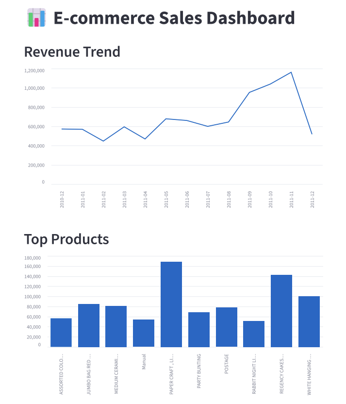

# 📊 E-commerce Sales Analysis

## Overview
This project analyzes e-commerce transaction data to uncover key business insights related to revenue trends, customer behavior, and product performance.

The goal is to transform raw transactional data into actionable insights using Python, SQL, and data visualization.

---

## Key Objectives
- Analyze monthly revenue trends
- Identify top-performing products
- Understand customer behavior (new vs repeat)
- Detect revenue concentration across countries
- Build a simple analytics dashboard

---

## Tech Stack
- Python (pandas, matplotlib)
- SQL (SQLite)
- Jupyter Notebook
- Streamlit (for dashboard)
- Git & GitHub

---

## 📂 Project Structure

```
Ecommerce-Sales-Analysis/
│
├── data/
│   └── online_retail.csv
│
├── notebook/
│   └── analysis.ipynb
│
├── sql/
│   └── queries.sql
│
├── app.py
├── ecommerce.db
├── images
├── requirements.txt
└── README.md
```

---

## Data Cleaning
- Standardized column names (lowercase, removed spaces)
- Handled missing values
- Converted date columns to datetime format
- Created new features (month, revenue)

---

## SQL Analysis
SQL was used to extract business insights from the cleaned dataset stored in SQLite.

Key SQL analyses include:
- Monthly revenue trend
- Top countries by revenue
- Top products by revenue
- Top customers by revenue
- New vs repeat customer analysis

---

## Key Insights
- Revenue shows an overall increasing trend, especially toward the end of the year
- A small number of products generate a large portion of total revenue
- The United Kingdom contributes the majority of revenue
- A small group of customers contributes significantly to total sales
- Repeat customers outnumber new customers, showing strong retention potential

---

## Business Recommendations
- Focus marketing and inventory planning around high-demand months
- Prioritize top-selling products to maximize revenue
- Reduce dependency on one major market by expanding into other countries
- Build loyalty programs for high-value and repeat customers
- Use customer segmentation to improve retention strategies

---

## 📊 Dashboard
An interactive dashboard was built with Streamlit to visualize:
- Revenue trend
- Top products
- Top customers
- Customer behavior

### Run the dashboard
```bash
streamlit run app.py
```
## Dashboard Preview



---

## How to Run the Project
### 1. Install dependencies
```bash
pip install -r requirements.txt
```
### 2. Open the notebook
```bash
jupyter notebook
```
### 3. Run the dashboard
```bash
streamlit run app.py
```

---

## Project Highlights
- Built a SQL-heavy business analytics project
- Created an interactive Streamlit dashboard
- Used SQL queries to answer real business questions
- Analyzed revenue, products, customers, and retention
- Turned raw transaction data into actionable insights

---

## Author
### Saba Aslani
Data Analyst / Data Engineer

