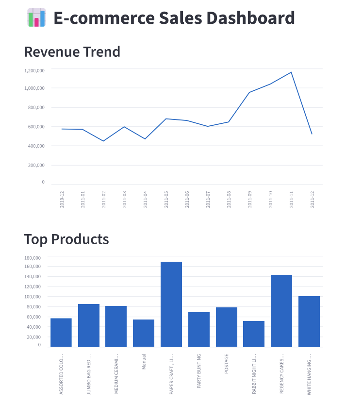

# E-commerce Sales Analysis
### Python · SQL · SQLite · Streamlit Dashboard


(https://ecommerce-sales-analysis-dashboard26.streamlit.app/)

---

## Overview

End-to-end sales analysis of a UK-based online retailer (Dec 2010 – Dec 2011). Covers data cleaning, revenue trend analysis, product and customer performance, and advanced SQL analytics — all served through an interactive Streamlit dashboard.

---

## Key Results

| Metric | Value |
|---|---|
| Top Market Revenue (UK) | $7,308,392 |
| Top Customer Revenue | $280,206 (74 orders) |
| Total Unique Customers | 4,339 |
| Repeat Customers | 2,845 (65.6%) |
| New Customers | 1,494 (34.4%) |
| Top Product Revenue | $168,470 (Paper Craft, Little Birdie) |

**Top 5 Countries by Revenue:**

| Country | Revenue |
|---|---|
| United Kingdom | $7,308,392 |
| Netherlands | $285,446 |
| EIRE | $265,546 |
| Germany | $228,867 |
| France | $209,024 |

---

## Project Structure

```
Ecommerce-Sales-Analysis/
│
├── data/
│   └── online_retail.csv
├── notebook/
│   └── analysis.ipynb        # Full analysis
├── sql/
│   └── queries.sql           # Advanced SQL queries
├── app.py                    # Streamlit dashboard
├── ecommerce.db              # SQLite database
└── requirements.txt
```

---

## Tech Stack

- **Python** — Pandas, Matplotlib, Seaborn
- **SQL / SQLite** — database storage + advanced queries
- **Streamlit** — interactive dashboard
- **Jupyter Notebook** — exploratory analysis

---

## Analysis Pipeline

### 1. Data Cleaning
- Standardized column names and datetime formats
- Removed missing CustomerIDs and negative/zero quantity transactions
- Engineered `revenue` feature (quantity × unit price)

### 2. Revenue Trend Analysis
Monthly revenue tracked from Dec 2010 to Dec 2011. Clear Q4 seasonal peak observed. Sharp drop in the final month reflects incomplete data rather than real decline.

### 3. Product Performance
Top 10 products by revenue identified via SQL. Revenue is heavily concentrated — the top product alone generated $168,470.

### 4. Customer Analysis
- 4,339 unique customers segmented into New vs Repeat
- **65.6% are Repeat customers** — strong retention signal
- Top customer generated $280,206 across 74 orders

### 5. Advanced SQL Analysis

Three SQL techniques applied on the SQLite database:

**Window Functions** — ranked all customers by total revenue using `RANK() OVER`

**Subquery** — identified transactions above average revenue to isolate high-value orders

**CTE** — calculated monthly revenue trend using `WITH monthly_revenue AS (...)`

---

## Key Insights

- **Geographic concentration:** UK accounts for ~88% of total revenue — international expansion is a high-upside opportunity
- **Repeat customers dominate:** 65.6% of customers return, indicating strong product-market fit and loyalty
- **Pareto effect in products:** A handful of products drive the majority of revenue — inventory and marketing should prioritize these
- **Seasonality:** Q4 consistently peaks — plan campaigns and stock accordingly
- **High-value customer risk:** Top customer alone contributes $280K — losing a single key account has outsized revenue impact

---

## Dashboard


To run locally:

```bash
git clone https://github.com/saba-aslani/Ecommerce-Sales-Analysis
cd Ecommerce-Sales-Analysis
pip install -r requirements.txt
streamlit run app.py
```

---

## Author

**Saba Aslani** — Data Analyst · Data Engineer  
[GitHub](https://github.com/saba-aslani) · [LinkedIn](https://www.linkedin.com/in/saba-aslani/)
